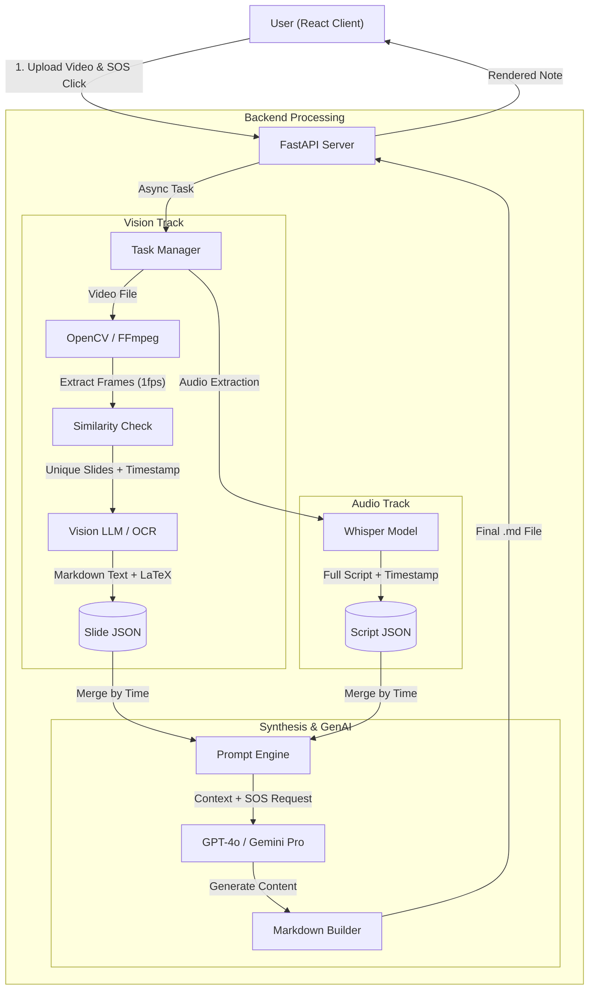
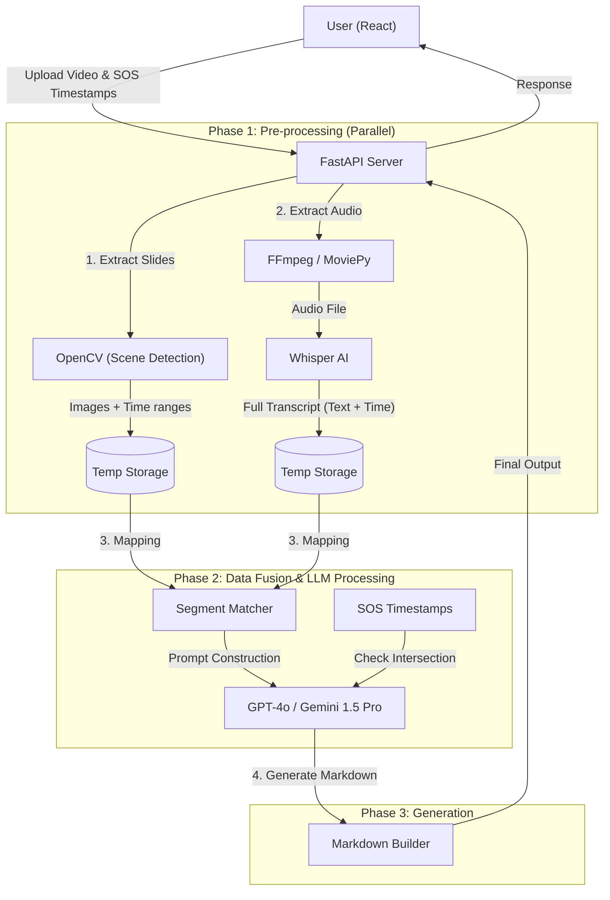

# MathPilot

# 1. 기획

### 슬라이드 강의 자동 단권화 솔루션

**강의는 듣는 것, 필기는 AI의 것. 듣는 순간 내 노트가 되는 학습 혁신 솔루션**
**"수업은 편하게 귀로 듣고, 필기는 AI가 다 끝내놓는"**

**사용자가 영상 재생 중에 필기하느라 멈출 필요가 없다.**

**수업 끝나면 책상 위에 놓여 있는 '완벽한 복습 노트'.**

**"필기 강박 내려놓고, 이해하는 데만 집중하세요. 기록은 AI가 남깁니다."**

## 1. 기획 개요 (Overview)

### 타겟 (Target)

- **Primary:** 전공 수업(수학, 공학)에서 수식과 도표가 많은 PPT 강의를 듣는 대학생.
- **Secondary:** 기술 컨퍼런스(NDC, PyCon 등) 영상을 빠르게 텍스트로 정리하고 싶은 개발자.

### 페인 포인트 (Pain Points)

1. **멀티태스킹의 한계:** 슬라이드 내용을 받아적다가 정작 강사의 중요한 구두 설명(Insight)을 놓침.
2. **비효율적인 복습:** "그 공식 설명할 때 무슨 예시를 들었지?"를 찾으려 영상을 하염없이 돌려봐야 함.
3. **자료의 파편화:** PDF 강의자료 따로, 필기 노트 따로, 녹화 영상 따로 놀아서 학습 흐름이 끊김.

### 핵심 가치 (Core Value)

1. **Automated Sync:** 시각 정보(슬라이드)와 청각 정보(음성 해설)를 AI가 자동으로 매핑하여 **'단권화된 노트'** 제공.
2. **Interactive Deep-Dive:** 이해가 안 가는 구간(SOS)은 AI가 **'과외 선생님'**처럼 심층 해설 제공.
3. **Searchable Knowledge:** 모든 영상 콘텐츠를 구조화된 Markdown($\LaTeX$)으로 변환하여 검색 및 2차 가공(Notion, PDF) 용이.

### AS IS vs TO BE

강의자료, 받아적은 노트, 따로 찾아본 gpt : 복잡해 죽겠네

통합 단권화 노트 -> 노션으로 간단하게 export ! : 너무 편하다.

# 2. input - process - output

## input 

1. video(audio, vision)
2. user의 잘 모르겠어요 timestamp

## process 

처리 계획 : vision과 audio의 분리

[ vision(ppt 슬라이드) ]

1. video to img (단, 1초마다 한 프레임씩을 default로, cli로 옵션 설정은 가능하도록.)

 - 전환은 vision간 유사도 급변화로 탐지.

2. 전환 timestamp(이전 화면에 비해 새로운 화면이)
3. img to text (OCR) -> 이후 구조화된 markdown 문서로 변환
   - 수학 강의 도메인이기 때문에, 수식을 LaTeX로 변환할 수 있어야 함.
     +. 추후, 판서까지 확장할 수 있음. 예를 들어, 비정형의 판서 내용을 제목, 본문, 공식으로 구조화하여 Notion이나 PDF 형태의 디지털 노트로 즉시 변환까지.

[ audio ]

1. STT (openai - whisper ai -> nvidia의 stt 모델 사용 가능성 있음.)
2. 이후 vision 타임스탬프 (vision2)에 맞추어 슬라이드 별로 요약 -> 앞뒤로 패딩을 넣어서 싱크 문제 방지
3. 이후 vision을 통해 산출된 markdown 문서에 요약 통합 -> 단권화 노트로 산출.
   (추후)

[ users ]

1. 잘 모르겠어요 timestamp가 어디 audio와 어디 vision에 해당하는지를 확인해서, 
   해당 부분에는 별도로 상세한 설명 달아주기  -> 단권화 노트에 통합.

## output

1. 단권화노트.md
   - 마크다운 렌더러 (react-markdown, rehype-katex) 붙여서 수식이 예쁘게 나오도록 처리

# 2. gemini 정리버전.

------

## 2. Input - Process - Output (IPO Flow)

### Input

1. **Video Source:** 강의 영상 파일 (mp4) 또는 URL.
2. **User Interaction (SOS):** "잘 모르겠어요" 버튼 클릭 타임스탬프 List.
   - *예: `[05:23, 12:40]` (이 구간은 추가 설명이 필요함)*

### Process (Parallel Pipeline)

**[Track A: Vision Processing (Slide Extraction)]**

1. **Frame Extraction:** 1초 단위로 프레임 추출 (Default).
2. **Scene Detection (중복 제거):**
   - `SSIM` 또는 `OpenCV` 히스토그램 비교를 통해 **화면 전환(Slide Transition)** 감지.
   - 유사도가 급격히 낮아지는 시점을 'New Slide'로 정의하고 해당 이미지 저장.
3. **Visual Structure OCR:**
   - 이미지를 텍스트로 변환하되, 단순 텍스트가 아닌 **구조 정보(제목, 본문, 수식)** 보존.
   - **Key Tech:** 수식은 반드시 $\LaTeX$ 포맷으로 변환 ($x = \frac{-b \pm \sqrt{b^2-4ac}}{2a}$).

**[Track B: Audio Processing (Contextualization)]**

1. **Speech-to-Text (STT):** Whisper AI를 활용하여 전체 스크립트 추출.
2. **Segmentation by Slide:**
   - Track A에서 얻은 **'슬라이드 전환 타임스탬프'**를 기준으로 스크립트를 분할.
   - *예: Slide 1이 00:00~02:10이라면, 해당 구간의 오디오 텍스트만 추출.*
3. **Context Fusion (Summarization):**
   - `System Prompt`: "너는 대학원생 조교야. 슬라이드 내용(OCR)과 강사의 말(STT)을 합쳐서 완벽한 요약 노트를 만들어."
   - 싱크 오류 방지를 위해 앞뒤 5~10초 패딩(Buffer)을 포함하여 문맥 파악.

**[Track C: User SOS Processing (Personalization)]**

1. **Mapping:** 사용자가 입력한 SOS 타임스탬프가 어느 슬라이드 구간에 속하는지 확인.
2. **Deep Explanation:**
   - 해당 구간에 대해서만 LLM Temperature를 낮추고 상세 설명 모드 가동.
   - *결과물:* 노트 해당 부분에 `💡 **심층 해설**` 블록 추가 (개념 정의, 예시, 유도 과정 상세 서술).

### 📤 Output

1. **Final Artifact:** `단권화노트.md` (Markdown File)
2. **Rendering:**
   - **Slide Image:** 해당 구간의 PPT 스크린샷 배치.
   - **Text:** 요약된 강의 내용.
   - **Math:** $\LaTeX$ 수식 렌더링.
   - **Annotations:** SOS 요청 구간에 대한 하이라이트 및 상세 주석.

------

## 3. 시스템 아키텍처 (System Architecture)

------

## 4. 기술 스택 (Tech Stack)

BE : fastapi
FE : react
AI : Vision, Audio, LLM

| **구분**        | **기술 (Technology)** | **상세 역할**                                                |
| --------------- | --------------------- | ------------------------------------------------------------ |
| **Frontend**    | **React**             | 비디오 플레이어, SOS 버튼 UI, 마크다운 뷰어 (`react-markdown`, `rehype-katex`) |
| **Backend**     | **FastAPI**           | 비동기 작업 처리(`BackgroundTasks`), REST API, 파일 업로드 처리 |
| **AI (Vision)** | **OpenCV**            | 프레임 추출 및 이미지 유사도(SSIM) 비교를 통한 슬라이드 전환 감지 |
| **AI (Audio)**  | **Whisper (OpenAI)**  | 고정밀 STT (한국어/영어 인식)                                |
| **AI (LLM)**    | **GPT-4o / Gemini**   | OCR 결과와 STT 스크립트 융합, 수식 $\LaTeX$ 변환, 마크다운 생성 |
| **Infra/Tools** | **FFmpeg**            | 비디오에서 오디오 추출 및 포맷 변환                          |

------

## 5. 해커톤 시연 시나리오 (Demo Flow)

1. **상황 설정:** 어려운 '위상수학' 또는 '딥러닝 수식' 강의를 듣는 학생.
2. **Action:**
   - 영상을 보다가 교수가 복잡한 수식을 설명할 때 **[모르겠어요 🤯]** 버튼 클릭.
   - 강의 종료 후 **[노트 생성]** 클릭.
3. **Result (Wow Point):**
   - 화면 왼쪽: 강의 슬라이드 이미지.
   - 화면 오른쪽: 깔끔하게 정리된 텍스트와 **완벽하게 변환된 $\LaTeX$ 수식**.
   - **SOS 결과:** 사용자가 버튼을 눌렀던 부분에 **"💡 여기는 고유값 분해(Eigen Decomposition)가 사용된 단계입니다. 왜냐하면..."**이라는 친절한 설명 박스가 생성되어 있음.

