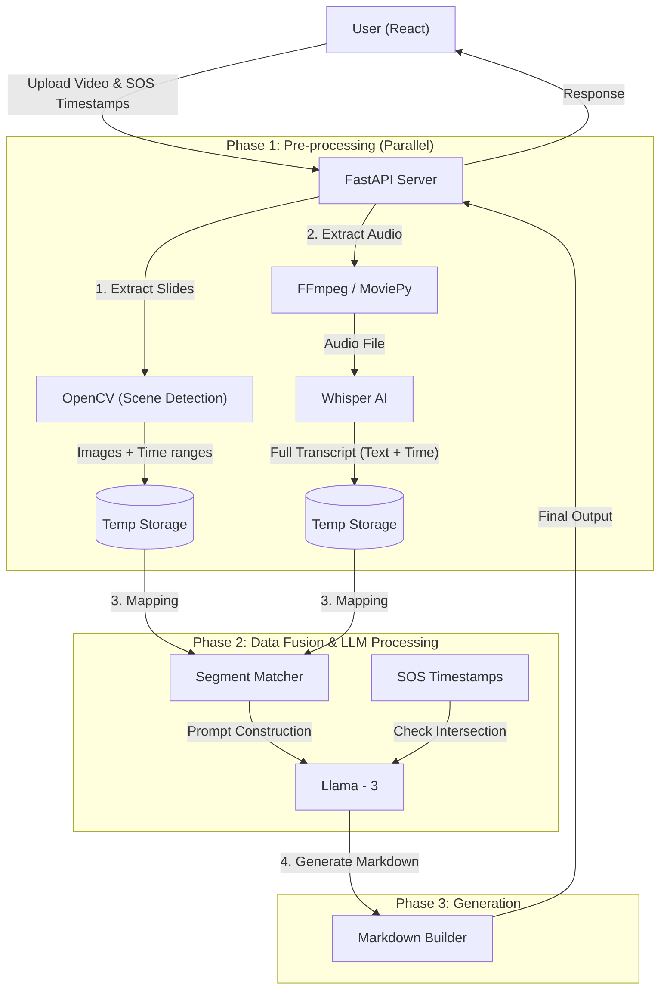
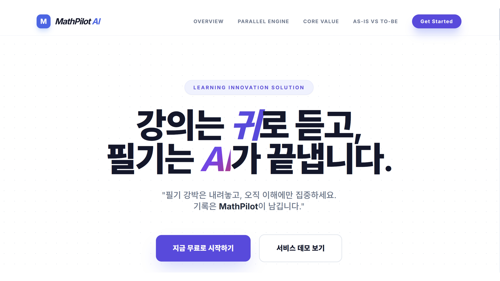
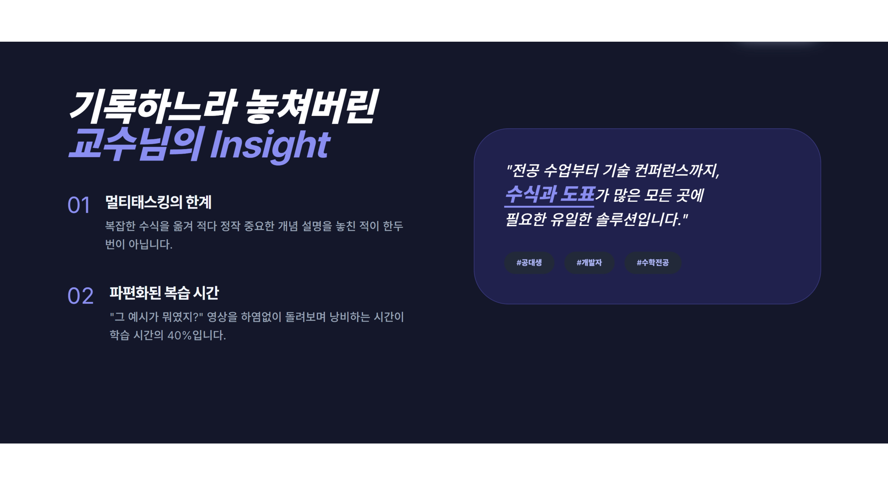
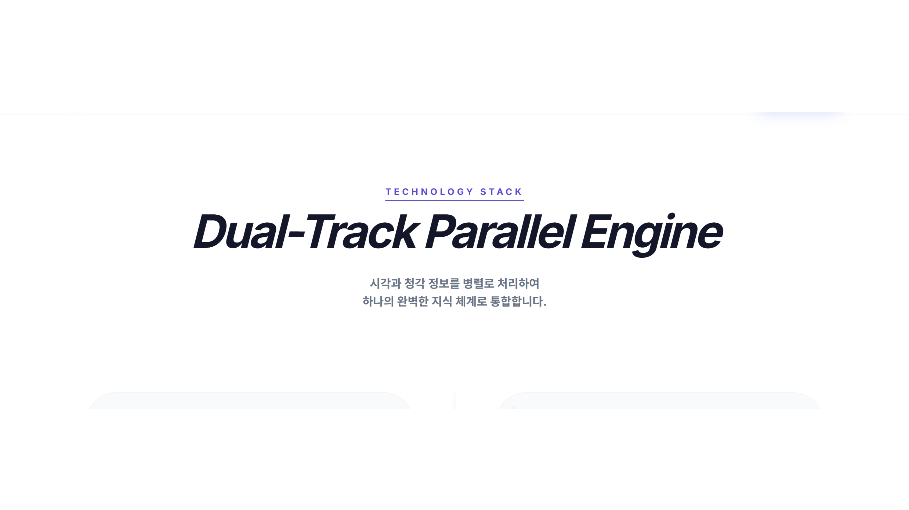
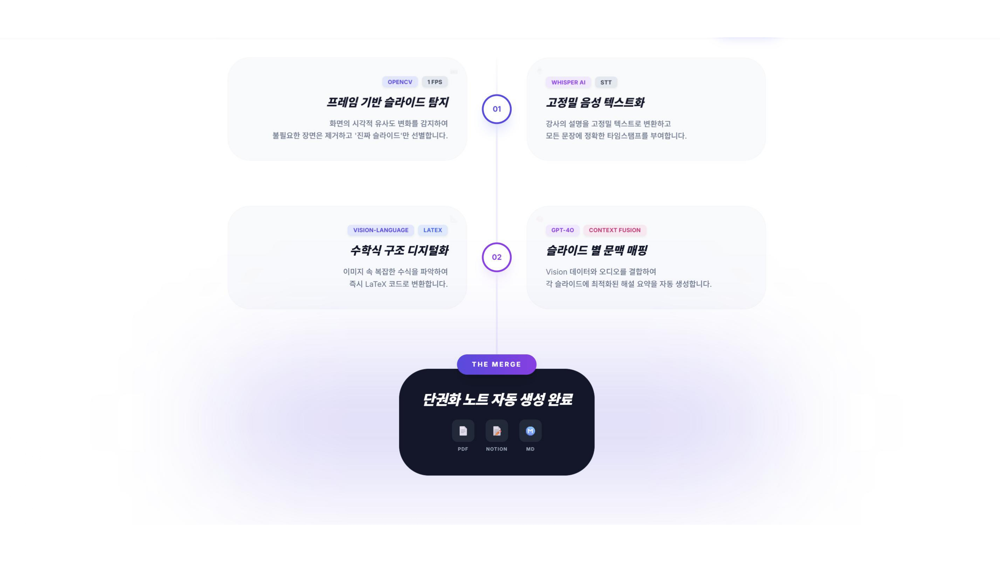
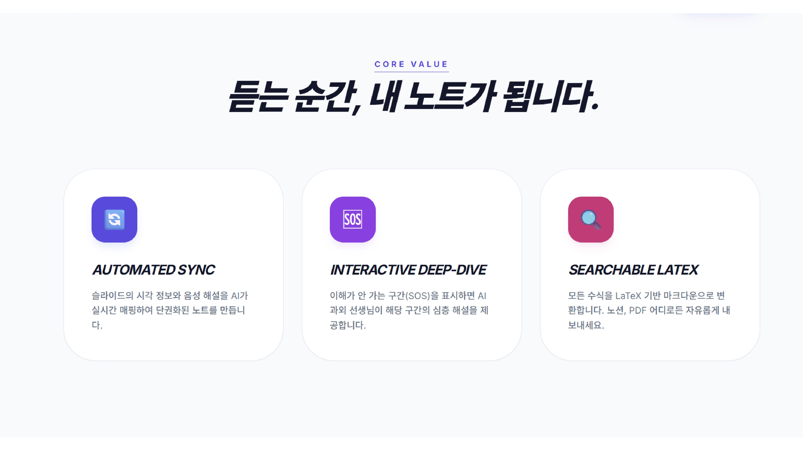

# MathPilot

> **강의는 듣는 것, 필기는 AI의 것**  
> 수업 끝나면 책상 위에 놓여 있는 완벽한 복습 노트

**슬라이드 강의 자동 단권화 솔루션**


---

## 📋 목차

1. [기획 개요](#1-기획-개요)
2. [시스템 구조](#2-시스템-구조)
3. [기술 스택](#3-기술-스택)
4. [처리 파이프라인](#4-처리-파이프라인)
5. [시연 시나리오](#5-시연-시나리오)
6. [프로젝트 실행](#6-프로젝트-실행)

---

## 1. 기획 개요

### 1.1 핵심 가치

**"필기 강박 내려놓고, 이해하는 데만 집중하세요. 기록은 AI가 남깁니다."**

- 사용자는 영상 재생 중 필기하느라 멈출 필요가 없음
- 수업 끝나면 자동으로 생성된 '완벽한 단권화 노트'가 준비됨

### 1.2 타겟 사용자

**Primary**
- 전공 수업(수학, 공학)에서 수식과 도표가 많은 PPT 강의를 듣는 대학생

**Secondary**
- 기술 컨퍼런스(NDC, PyCon 등) 영상을 빠르게 텍스트로 정리하고 싶은 개발자

### 1.3 페인 포인트

| 문제 | 설명 |
|------|------|
| **멀티태스킹의 한계** | 슬라이드 내용을 받아적다가 정작 강사의 중요한 구두 설명(Insight)을 놓침 |
| **비효율적인 복습** | "그 공식 설명할 때 무슨 예시를 들었지?"를 찾으려 영상을 하염없이 돌려봐야 함 |
| **자료의 파편화** | PDF 강의자료 따로, 필기 노트 따로, 녹화 영상 따로 놀아서 학습 흐름이 끊김 |

### 1.4 핵심 기능

#### 1️⃣ Automated Sync
시각 정보(슬라이드)와 청각 정보(음성 해설)를 AI가 자동으로 매핑하여 **단권화된 노트** 제공

#### 2️⃣ Interactive Deep-Dive (SOS)
이해가 안 가는 구간을 표시하면 AI가 **과외 선생님**처럼 심층 해설 제공

#### 3️⃣ Searchable Knowledge
모든 영상 콘텐츠를 구조화된 Markdown($\LaTeX$)으로 변환하여 검색 및 2차 가공(Notion, PDF) 용이

### 1.5 AS-IS vs TO-BE

| AS-IS | TO-BE |
|-------|-------|
|  |  |
| ❌ 강의자료 따로, 수기 필기 따로 | ✅ AI가 통합한 완벽한 단권화 노트 |
| ❌ 모르는 부분 찾으려 영상 10초씩 앞뒤로 | ✅ 텍스트 검색 한 번에 원하는 구간 이동 |
| ❌ 악필로 다시는 안 보게 되는 복습 노트 | ✅ 원클릭 노션 Export로 완성되는 포트폴리오 |

---

## 2. 시스템 구조

### 2.1 Input-Process-Output 흐름

#### 📥 Input
1. **Video Source**: 강의 영상 파일 (mp4) 또는 YouTube URL
2. **User Interaction (SOS)**: "잘 모르겠어요" 버튼 클릭 타임스탬프 List
   - 예: `[05:23, 12:40]` (이 구간은 추가 설명 필요)

#### ⚙️ Process (Dual-Track Parallel Engine)

**Track A: Vision Pipeline** 📸
1. **Frame Extraction**: 1초 단위로 프레임 추출 (Default)
2. **Scene Detection**: SSIM/히스토그램 비교로 화면 전환(Slide Transition) 감지
3. **OCR + Structure**: 이미지를 구조화된 Markdown으로 변환, 수식은 $\LaTeX$ 포맷으로

**Track B: Audio Pipeline** 🎙️
1. **Speech-to-Text**: Whisper AI로 전체 스크립트 추출
2. **Segmentation**: 슬라이드 전환 타임스탬프 기준으로 스크립트 분할
3. **Context Fusion**: OCR + STT를 통합하여 슬라이드별 요약 생성 (앞뒤 5초 패딩)

**Track C: SOS Processing** 🆘

1. **Mapping**: 사용자 SOS 타임스탬프가 속한 슬라이드 구간 확인
2. **Deep Explanation**: 해당 구간에 대해 LLM 기반 상세 해설 생성

#### 📤 Output
1. **Final Artifact**: `단권화노트.md` (Markdown File)
   - Slide 이미지
   - 구조화된 텍스트 (제목, 본문, 수식)
   - $\LaTeX$ 수식 렌더링
   - SOS 구간 심층 해설 (`💡 **심층 해설**` 블록)

### 2.2 시스템 아키텍처



---

## 3. 기술 스택

| 구분 | 기술 | 역할 |
|------|------|------|
| **Frontend** | React 19.2 | 비디오 플레이어, SOS 버튼 UI, 마크다운 뷰어<br/>(`react-markdown`, `rehype-katex`) |
| **Backend** | FastAPI | 비동기 작업 처리, REST API, 파일 업로드 |
| **Vision AI** | OpenCV | 프레임 추출 및 SSIM 기반 슬라이드 전환 감지 |
| **Audio AI** | Nvidia Riva | 고정밀 STT (한국어/영어 인식, grpc) |
| **LLM AI** | Llama - 3 | OCR+STT 융합, $\LaTeX$ 변환, 요약 생성 |
| **Infra** | FFmpeg | 비디오→오디오 추출 및 포맷 변환 |

---

## 4. 처리 파이프라인

### 4.1 Vision Processing (Track A)

```
Video Input
  ↓
Frame Extraction (1fps)
  ↓
Scene Detection (SSIM)
  ↓
Unique Slides + Timestamp
  ↓
OCR + LaTeX Conversion
  ↓
Structured Markdown
```

### 4.2 Audio Processing (Track B)

```
Video Input
  ↓
Audio Extraction (FFmpeg)
  ↓
STT (Nvidia Riva)
  ↓
Full Transcript + Timestamp
  ↓
Segmentation by Slide
  ↓
Audio Text per Slide
```

### 4.3 Synthesis & Generation

```
Slide Data + Audio Text
  ↓
Prompt Engineering
  ↓
LLM Processing (GPT-4o)
  ↓
Markdown Generation
  ↓
SOS Deep Explanation (if requested)
  ↓
Final Note (단권화노트.md)
```

---

## 5. 시연 시나리오

### 5.1 상황 설정
어려운 '위상수학' 또는 '딥러닝 수식' 강의를 듣는 학생

### 5.2 사용자 액션

1. 영상을 보다가 교수가 복잡한 수식을 설명할 때 **[모르겠어요 🆘]** 버튼 클릭
2. 강의 종료 후 **[강의 요약 생성하기]** 버튼 클릭

### 5.3 결과


**📝 생성된 단권화 노트 탭**: 

- 슬라이드별 구조화된 요약
- 완벽하게 변환된 $\LaTeX$ 수식
- **SOS 결과**: 사용자가 버튼을 눌렀던 부분에 다음과 같은 설명 박스 생성

```markdown
💡 **심층 해설**

### 1️⃣ 핵심 개념
여기는 고유값 분해(Eigen Decomposition)가 사용된 단계입니다.

### 2️⃣ 단계별 설명
**Step 1**: 행렬 A를 고유벡터 기저로 변환
**Step 2**: 대각 행렬로 단순화

### 3️⃣ 예시
[구체적인 수치 예시]

### 4️⃣ 핵심 정리
- 고유값은 행렬의 고유한 스케일링 계수
- 고유벡터는 변환되지 않는 방향
```

**🎬 원본 자료 탭**:

- 전체 STT 원본 텍스트 (줄 간격 넓게)

---

## 6. 프로젝트 실행

### 6.0 사이트 접속

[mathpilot.site](mathpilot.site)

### 6.1 환경 설정

**필수 요구사항**
- Python 3.12
- Node.js 18+
- FFmpeg 설치

### 6.2 Backend 실행

```bash
# 1. conda 환경 활성화
conda activate mathnote

# 2. 백엔드 디렉토리로 이동
cd backend

# 3. 서버 실행
python -m uvicorn app.main:app --host 0.0.0.0 --port 8000 --reload
```

### 6.3 Frontend 실행

```bash
# 1. 프론트엔드 디렉토리로 이동
cd frontend/mathnote-react

# 2. 의존성 설치 (최초 1회)
npm install

# 3. 개발 서버 실행
npm run dev
```

### 6.4 접속

- **Frontend**: http://localhost:3002
- **Backend API**: http://localhost:8000
- **API Docs**: http://localhost:8000/docs

### 6.5 빌드

```bash
# Frontend 프로덕션 빌드
cd frontend/mathnote-react
npm run build
```

---

## 7. 주요 기능

### 7.1 비디오 업로드
- 로컬 파일 (MP4, MOV) 최대 500MB
- YouTube URL 지원

### 7.2 실시간 SOS 기능
- 비디오 재생 중 🆘 버튼 클릭으로 타임스탬프 저장
- 클릭된 구간은 LLM이 심층 해설 생성

### 7.3 노트 생성
- Vision + Audio 처리 완료 후 "강의 요약 생성하기" 버튼 활성화
- 요약 생성 중에도 원본 자료 즉시 확인 가능
- 완료 후 재생성 가능

### 7.4 듀얼 탭 뷰
- **생성된 단권화 노트**: 슬라이드별 구조화된 요약, 수식, SOS 해설
- **원본 자료**: 전체 STT 텍스트

---

## 8. API 명세

### 8.1 비디오 업로드
```http
POST /api/v1/videos/upload
Content-Type: multipart/form-data

{
  "file": <video_file>,
  "frame_interval_sec": 1.0,
  "ssim_threshold": 0.85
}
```

### 8.2 YouTube 업로드
```http
POST /api/v1/videos/upload-youtube
Content-Type: application/json

{
  "youtube_url": "https://youtube.com/watch?v=...",
  "frame_interval_sec": 1.0
}
```

### 8.3 SOS 타임스탬프 추가
```http
POST /api/v1/videos/{task_id}/sos
Content-Type: application/json

{
  "timestamp": 123.45
}
```

### 8.4 요약 생성
```http
POST /api/v1/videos/{task_id}/generate-summary
```

### 8.5 노트 조회
```http
GET /api/v1/notes/{task_id}
```

---

## 9. 프로젝트 구조

```
project-mathnote/
├── backend/
│   ├── app/
│   │   ├── main.py                 # FastAPI 앱
│   │   ├── config.py               # 설정
│   │   ├── api/
│   │   │   ├── deps.py             # 의존성
│   │   │   └── routes/             # API 라우트
│   │   ├── services/
│   │   │   ├── video_service.py    # 비디오 처리
│   │   │   ├── audio/              # STT
│   │   │   ├── vision/             # OCR
│   │   │   ├── llm/                # LLM 클라이언트
│   │   │   └── synthesis/          # 통합 생성
│   │   └── schemas/                # Pydantic 모델
│   └── requirements.txt
│
└── frontend/
    └── mathnote-react/
        ├── src/
        │   ├── components/
        │   │   ├── welcome/        # 웰컴 페이지
        │   │   └── main/           # 메인 페이지
        │   ├── pages/
        │   ├── services/           # API 클라이언트
        │   └── types/              # TypeScript 타입
        └── package.json
```

---

# 발표 자료

[바로가기](docs/ASGI_pdf.pdf)












