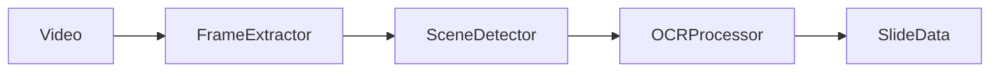
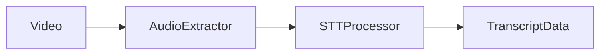
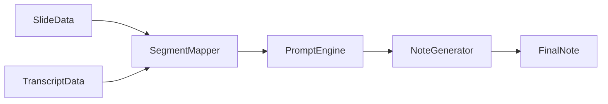

# 📁 MathNote 구조 초안 작업내역

> **작성일:** 2025-01-31 16:00  
> **상태:** ✅ 스캐폴딩 완료, 테스트 통과 (104/104)

---

## 1. 작업 개요

### 1.1 목표
강의 영상(Vision + Audio)을 분석하여 수식($\LaTeX$)이 포함된 **단권화 노트**를 자동 생성하는 FastAPI 백엔드 구조 설계 및 구현

### 1.2 완료된 작업
- [x] 레포지토리 구조 설계 및 생성
- [x] FastAPI 앱 스캐폴딩
- [x] 환경 설정 시스템 (Pydantic Settings)
- [x] API 엔드포인트 정의 (video, note)
- [x] 서비스 모듈 분리 (vision, audio, synthesis, llm, storage)
- [x] Pydantic 스키마 정의 (requests, responses)
- [x] S3 Presigned URL 기반 업로드 플로우
- [x] LLM 클라이언트 추상화 (OpenAI, Gemini)
- [x] Docker 및 docker-compose 설정
- [x] **테스트 코드 작성 (104개 테스트 모두 통과)**

---

## 2. 아키텍처 설계

### 2.1 전체 구조
```
project-mathnote/
├── backend/
│   ├── app/
│   │   ├── __init__.py
│   │   ├── main.py              # FastAPI 엔트리포인트
│   │   ├── config.py            # 환경 설정
│   │   ├── api/
│   │   │   ├── deps.py          # 의존성 주입
│   │   │   └── routes/
│   │   │       ├── video.py     # 영상 업로드/처리 API
│   │   │       └── note.py      # 노트 조회/다운로드 API
│   │   ├── core/
│   │   │   └── exceptions.py    # 커스텀 예외
│   │   ├── services/
│   │   │   ├── video_service.py # 파이프라인 오케스트레이션
│   │   │   ├── vision/          # Track A
│   │   │   ├── audio/           # Track B
│   │   │   ├── synthesis/       # Track C
│   │   │   ├── llm/             # LLM 클라이언트
│   │   │   └── storage/         # S3 스토리지
│   │   ├── schemas/
│   │   │   ├── requests.py      # 요청 스키마
│   │   │   └── responses.py     # 응답 스키마
│   │   └── utils/
│   │       └── time_utils.py    # 타임스탬프 유틸
│   ├── tests/
│   ├── requirements.txt
│   └── Dockerfile
├── docs/
├── frontend/                    # (추후)
├── .env.example
├── docker-compose.yml
└── README.md
```

### 2.2 계층 구조 (Layered Architecture)

```
┌─────────────────────────────────────────────────────────┐
│                    API Layer (routes/)                   │
│         HTTP 요청/응답 처리, 라우팅, 검증                   │
├─────────────────────────────────────────────────────────┤
│                  Service Layer (services/)               │
│            비즈니스 로직, 파이프라인 오케스트레이션            │
├─────────────────────────────────────────────────────────┤
│                 Schema Layer (schemas/)                  │
│           Pydantic 모델, 타입 안전성 확보                   │
├─────────────────────────────────────────────────────────┤
│                   Core Layer (core/)                     │
│              공통 설정, 예외, 횡단 관심사                    │
└─────────────────────────────────────────────────────────┘
```

---

## 3. 모듈별 설명

### 3.1 `app/config.py` - 설정 관리

**역할:** 환경 변수 기반 설정 관리 (하드코딩 방지)

**설계 근거:**
- README에서 "cli로 옵션 설정은 가능하도록" 요구사항
- Pydantic Settings로 타입 안전성 + 환경 분리
- `.env` 파일로 개발/프로덕션 설정 분리

**주요 설정:**
| 카테고리 | 설정 항목 | 설명 |
|---------|----------|------|
| API Keys | `OPENAI_API_KEY`, `GOOGLE_API_KEY` | LLM API 키 |
| AWS S3 | `AWS_ACCESS_KEY_ID`, `S3_BUCKET_NAME` 등 | 클라우드 스토리지 |
| Processing | `FRAME_INTERVAL_SEC`, `SSIM_THRESHOLD` | 처리 옵션 |
| LLM | `LLM_PROVIDER`, `LLM_MODEL`, `LLM_TEMPERATURE` | LLM 설정 |

---

### 3.2 `app/api/routes/` - API 라우터

#### `video.py`
**역할:** 영상 업로드 및 처리 API

| 엔드포인트 | 메서드 | 설명 |
|-----------|--------|------|
| `/upload-url` | POST | S3 Presigned Upload URL 발급 |
| `/{task_id}/confirm-upload` | POST | 업로드 완료 확인 |
| `/{task_id}/process` | POST | 처리 시작 (BackgroundTasks) |
| `/{task_id}/status` | GET | 처리 상태 조회 |

#### `note.py`
**역할:** 노트 조회 및 다운로드 API

| 엔드포인트 | 메서드 | 설명 |
|-----------|--------|------|
| `/{task_id}` | GET | 생성된 노트 조회 (JSON) |
| `/{task_id}/download` | GET | 마크다운 다운로드 URL |
| `/{task_id}/slides/{n}/image` | GET | 슬라이드 이미지 URL |

---

### 3.3 `app/services/vision/` - Vision Pipeline (Track A)

**역할:** 영상에서 슬라이드 추출 및 OCR



| 모듈 | 역할 | 기술 |
|------|------|------|
| `frame_extractor.py` | N초 간격 프레임 추출 | OpenCV / FFmpeg |
| `scene_detector.py` | 슬라이드 전환 감지 | SSIM 비교 |
| `ocr_processor.py` | 텍스트+수식 추출 | Vision LLM (GPT-4o-vision) |

**설계 근거:**
- 프레임 추출 → 장면 변경 감지 → OCR의 **순차적 파이프라인**
- SSIM으로 중복 프레임 제거 → API 비용 절감
- Vision LLM으로 OCR + LaTeX 변환 동시 처리 → 수식 정확도 향상

---

### 3.4 `app/services/audio/` - Audio Pipeline (Track B)

**역할:** 음성 인식 및 전사



| 모듈 | 역할 | 기술 |
|------|------|------|
| `audio_extractor.py` | 비디오에서 오디오 추출 | FFmpeg |
| `stt_processor.py` | 음성 → 텍스트 변환 | OpenAI Whisper |

**설계 근거:**
- Vision과 **독립적으로 병렬 처리** 가능
- Whisper는 타임스탬프 포함 전사 지원 → 슬라이드와 동기화 용이

---

### 3.5 `app/services/synthesis/` - Synthesis Pipeline (Track C)

**역할:** Vision + Audio 융합, 노트 생성



| 모듈 | 역할 |
|------|------|
| `segment_mapper.py` | 슬라이드 타임스탬프 기준 전사 분할, SOS 매핑 |
| `prompt_engine.py` | LLM 프롬프트 구성 (요약, SOS 해설) |
| `note_generator.py` | 마크다운 노트 조합 |

**설계 근거:**
- Vision/Audio 결과를 **타임스탬프 기준으로 매핑**
- 패딩(±5초)으로 싱크 오류 방지
- SOS 요청 구간에 대해 별도 심층 해설 생성

---

### 3.6 `app/services/llm/` - LLM 클라이언트

**역할:** LLM API 추상화

```
BaseLLMClient (Abstract)
    ├── OpenAIClient (GPT-4o, GPT-4o-vision)
    └── GeminiClient (Gemini Pro, Gemini Vision)
```

**설계 근거:**
- **Strategy 패턴** 적용 → Provider 교체 용이
- `LLM_PROVIDER` 환경 변수로 런타임에 선택
- Vision LLM 메서드 분리 (`analyze_image`, `analyze_image_url`)

---

### 3.7 `app/services/storage/` - 스토리지 클라이언트

**역할:** 클라우드 스토리지 추상화

```
BaseStorageClient (Abstract)
    └── S3StorageClient (AWS S3)
```

**설계 근거:**
- **Presigned URL** 방식 → 클라이언트가 S3에 직접 업로드
- 서버 부하 감소, 대용량 파일 처리 가능
- 추상화로 향후 GCS, Azure Blob 등 확장 가능

**S3 저장 구조:**
```
s3://mathnote-bucket/
├── videos/{task_id}/original.mp4
├── processing/{task_id}/
│   ├── frames/
│   ├── slides/
│   └── audio.wav
└── outputs/{task_id}/
    ├── note.md
    └── note.json
```

---

### 3.8 `app/schemas/` - Pydantic 스키마

**역할:** API 요청/응답 타입 정의

| 파일 | 내용 |
|------|------|
| `requests.py` | `UploadUrlRequest`, `ProcessVideoRequest`, `ProcessingOptions` |
| `responses.py` | `UploadUrlResponse`, `TaskStatusResponse`, `NoteResponse`, `SlideDetail` |

**설계 근거:**
- 기존 `models/video.py`, `slide.py`, `note.py` 분리 → **Request/Response 통합**
- API 개발 시 빠른 참조 가능
- 파일 개수 감소로 유지보수 단순화

---

### 3.9 `app/core/exceptions.py` - 예외 처리

**역할:** 커스텀 예외 및 HTTP Exception 팩토리

| 예외 | 용도 |
|------|------|
| `MathNoteException` | 기본 예외 |
| `VideoNotFoundError` | 영상 없음 |
| `VideoProcessingError` | 처리 실패 |
| `StorageError` | 스토리지 오류 |
| `LLMError` | LLM 호출 오류 |
| `TaskNotFoundError` | 태스크 없음 |

---

## 4. 모듈 분리 검증

### 4.1 분리 원칙 준수 여부

| 원칙 | 적용 상태 | 설명 |
|------|-----------|------|
| **단일 책임 원칙 (SRP)** | ✅ | 각 모듈이 하나의 명확한 역할 담당 |
| **개방-폐쇄 원칙 (OCP)** | ✅ | LLM/Storage 추상화로 확장 용이 |
| **의존성 역전 원칙 (DIP)** | ✅ | 추상 인터페이스에 의존, 구현체 교체 가능 |
| **관심사 분리** | ✅ | Vision/Audio/Synthesis 트랙 독립 |
| **테스트 용이성** | ✅ | 서비스 단위로 독립 테스트 가능 |

### 4.2 의존성 흐름

```
routes/ → deps.py → services/ → (llm/, storage/)
                          ↓
                     schemas/
```

- **단방향 의존성** 유지
- 순환 참조 없음
- 의존성 주입으로 결합도 낮춤

---

## 5. 실행 방법

### 5.1 로컬 개발 환경

```bash
# 1. 가상 환경 생성 (권장)
conda create -n mathnote python=3.11
conda activate mathnote

# 2. 디렉토리 이동
cd backend

# 3. 의존성 설치
pip install -r requirements.txt

# 4. 환경 변수 설정
cp ../.env.example ../.env
# .env 파일 편집하여 API 키 입력

# 5. 서버 실행
uvicorn app.main:app --reload --host 0.0.0.0 --port 8000
```

### 5.2 Docker 실행

```bash
# 프로젝트 루트에서
docker-compose up --build
```

### 5.3 API 문서 확인

서버 실행 후:
- **Swagger UI:** http://localhost:8000/docs
- **ReDoc:** http://localhost:8000/redoc
- **Health Check:** http://localhost:8000/health

---

## 6. 테스트 방법

### 6.1 테스트 실행

```bash
# backend 디렉토리에서

# 전체 테스트
pytest

# 커버리지 포함
pytest --cov=app --cov-report=html

# 특정 테스트 파일
pytest tests/test_api_video.py -v

# 특정 테스트 함수
pytest tests/test_api_video.py::test_get_upload_url -v
```

### 6.2 테스트 구조

```
tests/
├── __init__.py
├── conftest.py              # 공통 fixture
├── test_api_video.py        # Video API 테스트
├── test_api_note.py         # Note API 테스트
├── test_services_vision.py  # Vision 서비스 테스트
├── test_services_audio.py   # Audio 서비스 테스트
├── test_services_llm.py     # LLM 클라이언트 테스트
├── test_services_storage.py # Storage 테스트
└── test_utils.py            # 유틸리티 테스트
```

### 6.3 테스트 커버리지 목표

| 모듈 | 목표 커버리지 |
|------|--------------|
| API Routes | 90%+ |
| Services | 80%+ |
| Schemas | 100% |
| Utils | 100% |

### 6.4 현재 테스트 결과

```
============================= 104 passed in 0.27s =============================

테스트 파일별 통과 현황:
├── test_api_note.py ............ 5 passed
├── test_api_video.py ........... 8 passed
├── test_schemas.py ............. 12 passed
├── test_services_audio.py ...... 10 passed
├── test_services_llm.py ........ 7 passed
├── test_services_storage.py .... 11 passed
├── test_services_synthesis.py .. 9 passed
├── test_services_vision.py ..... 13 passed
└── test_utils.py ............... 17 passed
```

---

## 7. 다음 단계 (TODO)

### 7.1 MVP 구현
1. ⬜ `frame_extractor.py` - OpenCV 프레임 추출 구현
2. ⬜ `scene_detector.py` - SSIM 슬라이드 감지 구현
3. ⬜ `ocr_processor.py` - Vision LLM OCR 연동
4. ⬜ `audio_extractor.py` - FFmpeg 오디오 추출 구현
5. ⬜ `stt_processor.py` - Whisper STT 연동
6. ⬜ `video_service.py` - 전체 파이프라인 통합

### 7.2 확장 기능
- ⬜ SOS 심층 해설 기능
- ⬜ React 프론트엔드
- ⬜ 스트리밍 처리 (긴 영상)
- ⬜ Redis 기반 태스크 상태 관리

---

## 8. 기술 결정 요약

| 항목 | 선택 | 근거 |
|------|------|------|
| OCR | Vision LLM | 수식 인식 정확도 높음 |
| 스토리지 | AWS S3 | Presigned URL로 직접 업로드 |
| 비동기 처리 | BackgroundTasks | MVP에 적합 |
| LLM 추상화 | Strategy 패턴 | Provider 교체 용이 |
| 스키마 구조 | Request/Response 분리 | 직관적 관리 |
