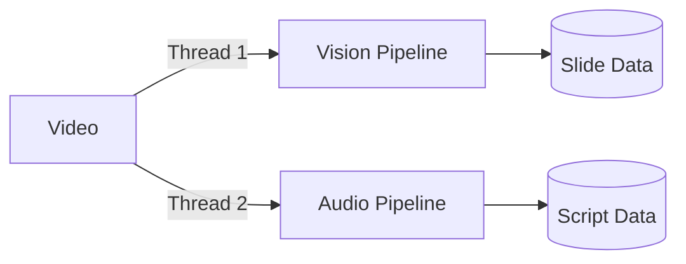
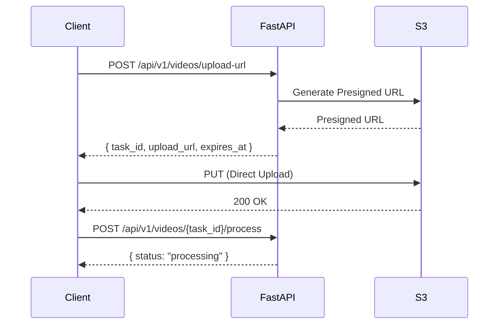

# 📋 MathNote 구현 계획서

## 1. 프로젝트 개요

**목표:** 강의 영상(Vision + Audio)을 분석하여 수식($\LaTeX$)이 포함된 단권화 노트를 자동 생성하는 솔루션

---

## 2. 제안 레포지토리 구조

```
project-mathnote/
├── backend/                    # FastAPI 백엔드
│   ├── app/
│   │   ├── __init__.py
│   │   ├── main.py            # FastAPI 엔트리포인트
│   │   ├── config.py          # 환경 설정 (Pydantic Settings)
│   │   ├── api/
│   │   │   ├── __init__.py
│   │   │   ├── routes/
│   │   │   │   ├── __init__.py
│   │   │   │   ├── video.py   # 영상 업로드/처리 API
│   │   │   │   └── note.py    # 노트 생성/조회 API
│   │   │   └── deps.py        # 의존성 주입
│   │   ├── core/
│   │   │   ├── __init__.py
│   │   │   └── exceptions.py  # 커스텀 예외
│   │   ├── services/          # 비즈니스 로직 계층
│   │   │   ├── __init__.py
│   │   │   ├── video_service.py
│   │   │   ├── vision/
│   │   │   │   ├── __init__.py
│   │   │   │   ├── frame_extractor.py    # 프레임 추출 (OpenCV/FFmpeg)
│   │   │   │   ├── scene_detector.py     # 슬라이드 전환 감지 (SSIM)
│   │   │   │   └── ocr_processor.py      # Vision LLM OCR + LaTeX 변환
│   │   │   ├── audio/
│   │   │   │   ├── __init__.py
│   │   │   │   ├── audio_extractor.py    # 오디오 추출 (FFmpeg)
│   │   │   │   └── stt_processor.py      # Whisper STT
│   │   │   ├── synthesis/
│   │   │   │   ├── __init__.py
│   │   │   │   ├── segment_mapper.py     # Vision-Audio 타임스탬프 매핑
│   │   │   │   ├── prompt_engine.py      # LLM 프롬프트 구성
│   │   │   │   └── note_generator.py     # 마크다운 노트 생성
│   │   │   ├── llm/
│   │   │   │   ├── __init__.py
│   │   │   │   ├── base.py               # LLM 추상 인터페이스
│   │   │   │   ├── openai_client.py      # OpenAI (GPT-4o-vision)
│   │   │   │   └── gemini_client.py      # Google Gemini Vision
│   │   │   └── storage/
│   │   │       ├── __init__.py
│   │   │       ├── base.py               # 스토리지 추상 인터페이스
│   │   │       └── s3_client.py          # AWS S3 클라이언트
│   │   ├── schemas/           # Pydantic 스키마 (Request/Response 통합)
│   │   │   ├── __init__.py
│   │   │   ├── requests.py    # 모든 요청 스키마
│   │   │   └── responses.py   # 모든 응답 스키마
│   │   └── utils/
│   │       ├── __init__.py
│   │       └── time_utils.py
│   ├── tests/
│   │   ├── __init__.py
│   │   ├── conftest.py
│   │   └── ...
│   ├── requirements.txt
│   └── Dockerfile
├── frontend/                   # React 프론트엔드 (추후)
├── docs/                       # 문서
│   ├── IMPLEMENTATION_PLAN.md
│   └── API_SPEC.md
├── sample_videos/              # 로컬 테스트용 샘플 영상
├── .env.example                # 환경 변수 템플릿
├── .gitignore
├── README.md
└── docker-compose.yml
```

---

## 3. 구조 설계 근거

### 3.1 계층 분리 (Layered Architecture)

| 계층 | 역할 | 근거 |
|------|------|------|
| `api/routes/` | HTTP 요청/응답 처리 | 라우팅 로직과 비즈니스 로직 분리 → 테스트 용이 |
| `services/` | 핵심 비즈니스 로직 | 재사용 가능한 서비스 단위로 분리 |
| `models/` | 데이터 스키마 | Pydantic으로 타입 안전성 확보 |
| `core/` | 공통 설정/예외 | 횡단 관심사 중앙화 |

### 3.2 서비스 모듈 분리

```
services/
├── vision/      # Track A: 슬라이드 추출 + Vision LLM OCR
├── audio/       # Track B: 음성 처리  
├── synthesis/   # 융합 및 노트 생성
├── llm/         # LLM 클라이언트 추상화
└── storage/     # S3 스토리지 추상화
```

**근거:**
- README의 **Parallel Pipeline** 구조 반영 (Vision Track / Audio Track / Synthesis)
- 각 트랙이 **독립적으로 테스트** 가능
- LLM 클라이언트 추상화로 **GPT-4o ↔ Gemini 교체 용이** (하드코딩 방지)
- Storage 추상화로 S3 외 다른 클라우드 스토리지 확장 가능

### 3.3 스키마 구조 (models → schemas 변경)

```
schemas/
├── requests.py    # 모든 API 요청 스키마
└── responses.py   # 모든 API 응답 스키마
```

**변경 근거:**
- 기존 `models/video.py`, `slide.py`, `note.py` 파일별 분리 → **관심사별 통합**
- Request/Response 구분이 더 직관적 (API 개발 시 빠른 참조)
- 파일 개수 감소로 유지보수 단순화

### 3.4 설정 관리 (하드코딩 지양)

```python
# config.py 예시
from pydantic_settings import BaseSettings

class Settings(BaseSettings):
    # API Keys
    OPENAI_API_KEY: str
    GOOGLE_API_KEY: str | None = None
    
    # AWS S3 설정
    AWS_ACCESS_KEY_ID: str
    AWS_SECRET_ACCESS_KEY: str
    AWS_REGION: str = "ap-northeast-2"
    S3_BUCKET_NAME: str
    S3_PRESIGNED_URL_EXPIRY: int = 3600  # 1시간
    
    # Processing Options
    FRAME_INTERVAL_SEC: float = 1.0        # 프레임 추출 간격
    SSIM_THRESHOLD: float = 0.85           # 슬라이드 전환 감지 임계값
    AUDIO_PADDING_SEC: float = 5.0         # 오디오 싱크 패딩
    
    # LLM Settings
    LLM_PROVIDER: str = "openai"           # "openai" | "gemini"
    LLM_MODEL: str = "gpt-4o"
    LLM_TEMPERATURE: float = 0.3
    
    class Config:
        env_file = ".env"
```

**근거:**
- README에서 "cli로 옵션 설정은 가능하도록" 언급 → 환경변수/설정 파일로 관리
- `.env` 파일로 개발/프로덕션 환경 분리

---

## 4. 핵심 파이프라인 구현 계획

### Phase 1: Pre-processing (병렬 처리)



| 단계 | 모듈 | 기술 | 출력 |
|------|------|------|------|
| 1-A1 | `frame_extractor.py` | OpenCV / FFmpeg | 프레임 이미지 (N초 간격) |
| 1-A2 | `scene_detector.py` | SSIM 비교 | 고유 슬라이드 + 타임스탬프 |
| 1-A3 | `ocr_processor.py` | Vision LLM | 구조화된 텍스트 + LaTeX |
| 1-B1 | `audio_extractor.py` | FFmpeg | 오디오 파일 (.wav) |
| 1-B2 | `stt_processor.py` | Whisper | 전체 스크립트 + 타임스탬프 |

### Phase 2: Data Fusion

| 단계 | 모듈 | 설명 |
|------|------|------|
| 2-1 | `segment_mapper.py` | 슬라이드 타임스탬프 기준으로 스크립트 분할 |
| 2-2 | `prompt_engine.py` | OCR + STT + SOS 정보를 LLM 프롬프트로 구성 |

### Phase 3: Generation

| 단계 | 모듈 | 설명 |
|------|------|------|
| 3-1 | `note_generator.py` | LLM 응답을 마크다운 문서로 조합 |

---

## 5. API 엔드포인트 (S3 Presigned URL 기반)

### 5.1 영상 업로드 Flow



### 5.2 엔드포인트 상세

```yaml
# ==================== VIDEO ====================

POST /api/v1/videos/upload-url
  # S3 Presigned Upload URL 발급
  Request:
    - filename: string (예: "lecture.mp4")
    - content_type: string (예: "video/mp4")
  Response:
    - task_id: string (UUID)
    - upload_url: string (S3 Presigned PUT URL)
    - expires_at: datetime

POST /api/v1/videos/{task_id}/confirm-upload
  # 업로드 완료 확인 및 S3 객체 검증
  Response:
    - task_id: string
    - s3_key: string
    - status: "uploaded"

POST /api/v1/videos/{task_id}/process
  # 처리 시작 (BackgroundTasks)
  Request:
    - sos_timestamps: list[float] (선택, 예: [123.5, 456.2])
    - options:
        - frame_interval_sec: float (기본값: config에서)
        - ssim_threshold: float (기본값: config에서)
  Response:
    - task_id: string
    - status: "processing"
    - estimated_time_sec: int (추정 처리 시간)

GET /api/v1/videos/{task_id}/status
  # 처리 상태 조회
  Response:
    - task_id: string
    - status: "pending" | "processing" | "completed" | "failed"
    - progress:
        - vision: float (0.0 ~ 1.0)
        - audio: float (0.0 ~ 1.0)
        - synthesis: float (0.0 ~ 1.0)
    - error_message: string | null

# ==================== NOTES ====================

GET /api/v1/notes/{task_id}
  # 생성된 노트 조회 (JSON)
  Response:
    - task_id: string
    - title: string
    - slides:
        - slide_number: int
        - timestamp_start: float
        - timestamp_end: float
        - image_url: string (S3 Presigned GET URL)
        - ocr_content: string (LaTeX 포함 마크다운)
        - audio_summary: string
        - sos_explanation: string | null
    - created_at: datetime

GET /api/v1/notes/{task_id}/download
  # 마크다운 파일 다운로드 URL
  Response:
    - download_url: string (S3 Presigned GET URL)
    - filename: string
    - expires_at: datetime

GET /api/v1/notes/{task_id}/slides/{slide_number}/image
  # 특정 슬라이드 이미지 URL
  Response:
    - image_url: string (S3 Presigned GET URL)
    - expires_at: datetime
```

### 5.3 S3 저장 구조

```
s3://mathnote-bucket/
├── videos/
│   └── {task_id}/
│       └── original.mp4          # 원본 영상
├── processing/
│   └── {task_id}/
│       ├── frames/               # 추출된 프레임
│       │   ├── frame_0001.jpg
│       │   └── ...
│       ├── slides/               # 고유 슬라이드 이미지
│       │   ├── slide_001.jpg
│       │   └── ...
│       └── audio.wav             # 추출된 오디오
└── outputs/
    └── {task_id}/
        ├── note.md               # 최종 마크다운
        └── note.json             # 구조화된 데이터
```

---

## 6. 우선순위 및 구현 순서

### MVP (해커톤 시연용)
1. ✅ 레포 구조 세팅
2. ⬜ Vision Pipeline (frame_extractor → scene_detector → ocr_processor)
3. ⬜ Audio Pipeline (audio_extractor → stt_processor)  
4. ⬜ Synthesis (segment_mapper → note_generator)
5. ⬜ API 엔드포인트 연결

### 확장 (Post-MVP)
- SOS 심층 해설 기능
- React 프론트엔드
- 스트리밍 처리 (긴 영상)
- 캐싱 및 중복 처리 방지

---

## 7. 확정된 기술 결정

| 항목 | 선택 | 비고 |
|------|------|------|
| **OCR 방식** | Vision LLM (GPT-4o-vision / Gemini Vision) | 수식 인식 정확도 높음 |
| **임시 파일 저장** | AWS S3 | Presigned URL로 직접 업로드/다운로드 |
| **비동기 처리** | FastAPI BackgroundTasks | MVP에 적합, 단일 서버 |
| **스키마 구조** | `schemas/requests.py`, `responses.py` | Request/Response 통합 관리 |

---

## 8. 다음 단계

위 계획에 대해 **컨펌**해주시면:
1. 레포 구조 생성 (폴더 + 기본 파일)
2. 설정 파일 (`.env.example`, `config.py`)
3. 기본 FastAPI 앱 스캐폴딩
4. S3 클라이언트 기본 구현
